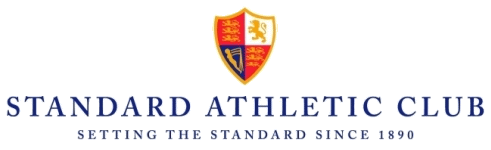

## SAC website project

I am a member of a multisports and social british club in Paris suburb, The Standard Athletic Club.
The SAC would like to give a new look to its website, currently under Joomla.  This code is a project to redesign the website.

Language : PHP 7
Framework: Laravel
Template: FreeHTML5.co

## About Standard Athletic Club
The Standard Athletic Club is hidden in the forest of Meudon just minutes from the Etoile.
It is Paris's premier International English-speaking Sports and Social Club, the perfect place for all the family to play sports casually or competitively or just relax and enjoy the social life.

## About Laravel

Laravel is a web application framework with expressive, elegant syntax. We believe development must be an enjoyable and creative experience to be truly fulfilling. Laravel takes the pain out of development by easing common tasks used in many web projects.

## Contributing

Thank you for considering contributing to the Laravel framework! The contribution guide can be found in the [Laravel documentation](https://laravel.com/docs/contributions).

## Code of Conduct

In order to ensure that the Laravel community is welcoming to all, please review and abide by the [Code of Conduct](https://laravel.com/docs/contributions#code-of-conduct).

## Security Vulnerabilities

If you discover a security vulnerability within Laravel, please send an e-mail to Taylor Otwell via [taylor@laravel.com](mailto:taylor@laravel.com). All security vulnerabilities will be promptly addressed.

## License

The Laravel framework is open-sourced software licensed under the [MIT license](https://opensource.org/licenses/MIT).
